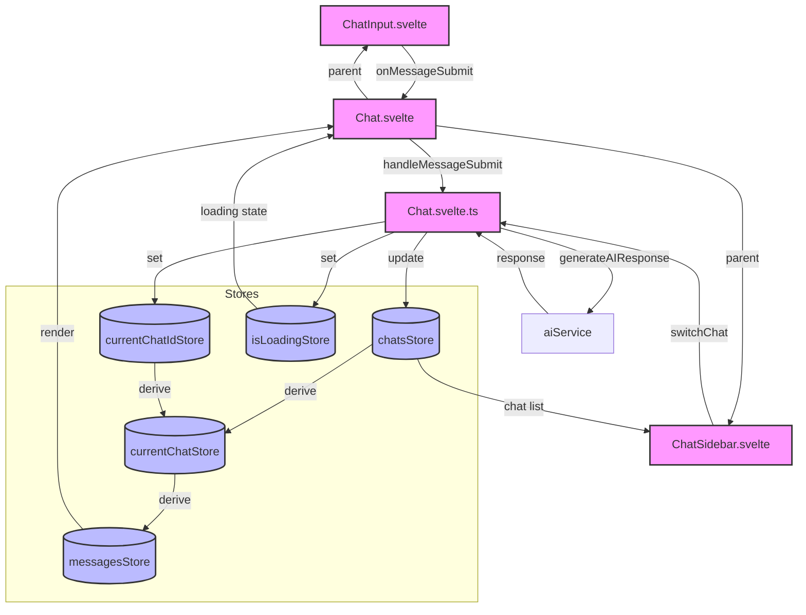
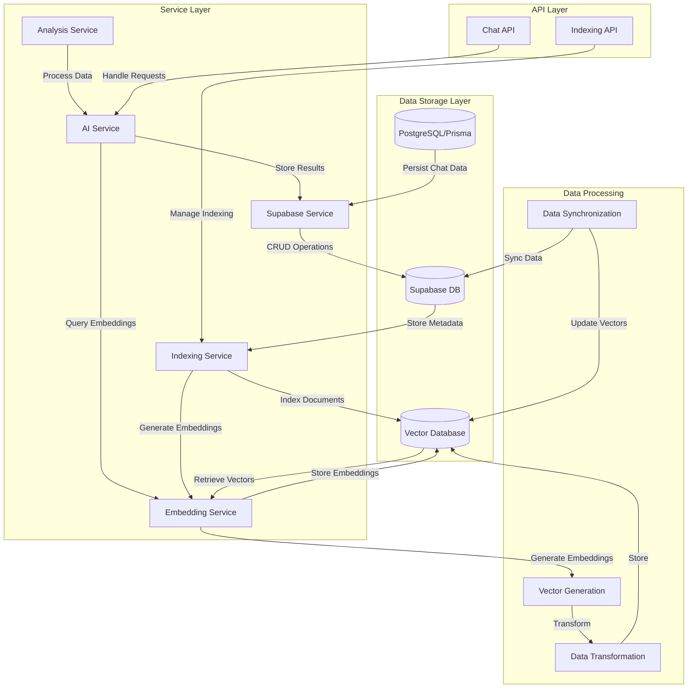
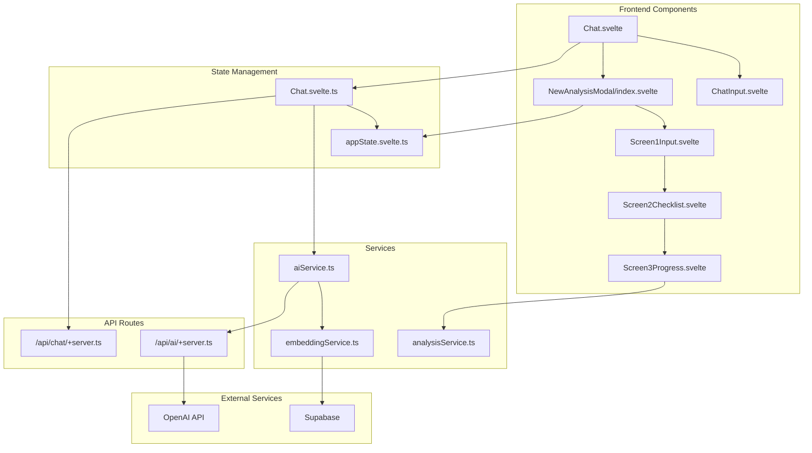

# AI Strategy Analyzer - System Context & Memory

## Project Overview

- SvelteKit application for AI-powered analysis of brand strategies
- Uses Svelte 5 runes ($state, $derived) for state management
- Built with Tailwind CSS and Skeleton UI components

## Chat System Architecture

### Component Structure

- `Chat.svelte`: Main container component
- `ChatInput.svelte`: Message input handling
- `ChatSidebar.svelte`: Chat list and navigation
- `Chat.svelte.ts`: Core business logic and state management

### State Management

1. Primary Stores (in Chat.svelte.ts):
   - `chatsStore`: Writable store for all chats
   - `currentChatIdStore`: Writable store for active chat ID
   - `isLoadingStore`: Writable store for loading state
2. Derived Stores:
   - `currentChatStore`: Derived from chats and currentChatId
   - `messagesStore`: Derived from currentChat

### Data Flow

1. User Input Flow:

   - ChatInput.svelte captures message input
   - Emits to parent via `onMessageSubmit` prop
   - Chat.svelte handles submission via `handleMessageSubmit`
   - Updates chat store with new message
   - Triggers AI response generation

2. Chat Navigation Flow:

   - ChatSidebar.svelte displays chat list
   - Uses `chatManager.switchChat()` for navigation
   - Updates `currentChatIdStore`
   - Triggers derived store updates

3. Message Display Flow:
   - Chat.svelte renders messages from `messagesStore`
   - Handles auto-scrolling via `$effect`
   - Formats messages with markdown
   - Shows loading state during AI responses

### Integration Points

- AI Service: `$lib/services/aiService`
- Sample Data: `$lib/data/sampleChats`
- Markdown Processing: Uses `marked` library

### Core Operations

1. Message Handling:

   - User message creation
   - AI response generation via aiService
   - Message formatting with marked library
   - Auto-scrolling to latest messages

2. Chat Management:
   - Create/delete chats
   - Switch between chats
   - Search functionality (UI prepared)
   - Chat naming conventions (Brand,Category,Region)

### State Updates

- Uses Svelte 5 runes ($state, $derived) for reactivity
- Implements store-based state management
- Maintains atomic updates for chat modifications
- Handles loading states during async operations

### Data Types

```typescript
interface Message {
	id: number;
	sender: 'user' | 'ai';
	content: string;
	timestamp: string;
	status: string;
}

interface Chat {
	id: number;
	name: string;
	messages: Message[];
	createdAt: string;
}
```

## UI Layout Implementation

### Chat Component Structure

- `Chat.svelte`: Main container with message display
- `ChatInput.svelte`: Text input for sending messages
- `ChatSidebar.svelte`: Sidebar with chat history
- `Chat.svelte.ts`: Business logic and state management

### Layout Optimizations

1. **Isolated Scrolling**

   - Only the message section is scrollable
   - Chat input and header remain fixed
   - Implemented using `overflow-y-auto` on message container only
   - Parent containers use `overflow-hidden` to prevent double scrolling

2. **Responsive Design**

   - Sidebar collapses on mobile screens
   - Uses Tailwind's responsive grid: `grid-cols-1 lg:grid-cols-[30%_1fr]`
   - Full height layout with proper constraints

3. **Markdown Rendering**

   - Uses the `marked` library for parsing markdown
   - Content is rendered as HTML with `{@html marked(message.content)}`
   - Custom styling for markdown elements in chat bubbles

4. **Auto-scrolling**
   - Messages automatically scroll to bottom on new content
   - Uses `$effect` hook for reactive scrolling
   - Implements smooth scrolling on new messages

### Enhanced Chat Features

1. **Model Selection & Status**

   - Model dropdown in header beside status indicator
   - Status indicators:
     - Active (green): API connected and responsive
     - Inactive (red): API connection failed
   - Available models: GPT-4o, GPT-4o Mini

2. **Chat Input Enhancements**

   - Feature toggles above input:
     - Web Search: Enable/disable web search capability
     - Reasoning: Enable/disable step-by-step reasoning
   - Displayed as interactive badges/checkboxes
   - Export chat to Markdown functionality

3. **Sidebar Improvements**
   - Settings component in sidebar footer
   - Model configuration
   - Default feature preferences

### Data Types Updates

```typescript
interface ChatSettings {
	model: AIModel;
	webSearch: boolean;
	webSearchContextSize: SearchContextSize;
	reasoning: boolean;
}

interface ChatStatus {
	isActive: boolean;
	lastChecked: string;
	error?: string;
}

// Updated Chat interface
interface Chat {
	id: number;
	name: string;
	messages: Message[];
	createdAt: string;
	settings: ChatSettings;
	status: ChatStatus;
}
```

### State Management Updates

1. **Chat Settings Store**

   - Model selection
   - Feature toggles state
   - API connection status

2. **Export Functionality**
   - Markdown conversion
   - File download handling
   - Message formatting

### CSS Implementation Details

- Fixed height containers with `h-full` and `max-h-[calc(100vh-2rem)]`
- Flex layout for vertical sections: `flex flex-col`
- Grid layout for horizontal sections: `grid grid-cols-1 lg:grid-cols-[30%_1fr]`
- Proper overflow handling: `overflow-y-auto` for scrollable sections, `overflow-hidden` for containers

## Integration Points

- AI Service: `$lib/services/aiService`
- Sample Data: `$lib/data/sampleChats`
- Markdown Processing: Uses `marked` library

## Future Considerations

- Message persistence
- Chat export functionality
- User authentication
- Real-time collaboration features

## Data Flow Diagram



### Key Data Flows

1. **Message Input Flow**

   ```
   ChatInput.svelte
   └─> onMessageSubmit()
       └─> Chat.svelte::handleMessageSubmit()
           └─> Chat.svelte.ts::handleMessageSubmit()
               ├─> Update chatsStore
               ├─> Set isLoadingStore
               ├─> Call aiService.generateAIResponse()
               └─> Update chatsStore with AI response
   ```

2. **Chat Navigation Flow**

   ```
   ChatSidebar.svelte
   └─> chatManager.switchChat()
       └─> Chat.svelte.ts
           ├─> Set currentChatIdStore
           └─> Trigger derived store updates
               ├─> Update currentChatStore
               └─> Update messagesStore
   ```

3. **Store Updates Flow**

   ```
   Stores
   ├─> chatsStore (Writable)
   ├─> currentChatIdStore (Writable)
   ├─> isLoadingStore (Writable)
   ├─> currentChatStore (Derived)
   │   └─> Derived from: chatsStore + currentChatIdStore
   └─> messagesStore (Derived)
       └─> Derived from: currentChatStore
   ```

4. **Display Update Flow**
   ```
   Chat.svelte
   ├─> Renders messages from messagesStore
   ├─> Shows loading state from isLoadingStore
   ├─> Auto-scrolls on message updates
   └─> Formats messages with marked library
   ```

### State Management Pattern

```
ChatManager (Chat.svelte.ts)
├─> Writable Stores
│   ├─> chatsStore: Chat[]
│   ├─> currentChatIdStore: number
│   └─> isLoadingStore: boolean
└─> Derived Stores
    ├─> currentChatStore: Chat
    └─> messagesStore: Message[]
```




